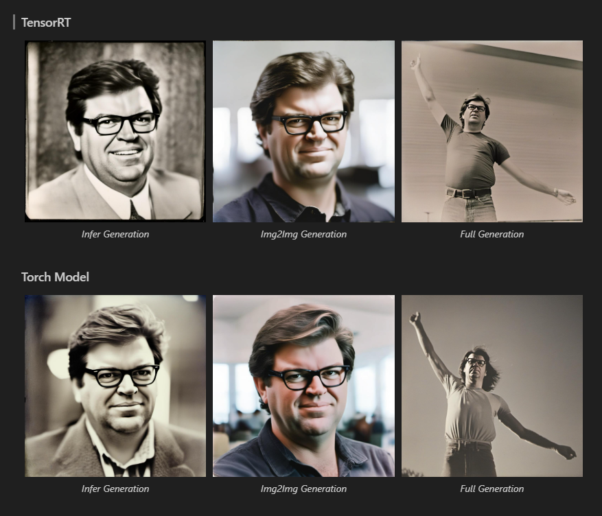

# InstantID with TensorRT

[](https://github.com/InstantID/InstantID)
[](https://developer.nvidia.com/tensorrt)

## Performance Comparison

**Test Environment:** NVIDIA GeForce RTX 4090

| Method | Demo Infer Time | Demo Infer_Img2Img Time | Demo Infer_Full Time |
|--------|----------------|----------------|----------------|
| InstantID with TensorRT | 3.37s | 3.02s |3.64s |
| InstantID with PyTorch | 5.54s |6.06s |5.99s |

> 💡 TensorRT acceleration provides a **More than 40% speedup** for InstantID inference

## Inference Time Analysis

The following table shows the component-wise and total inference time for the `infer_full` demo:

| Backend | UNET | CLIP | CLIP2 | ControlNet | ControlNetDepth | Total Image Generation |
|---------|------|------|-------|------------|-----------------|------------------------|
| TensorRT FP16 | 0.072s | 0.070s | 0.012s | 0.030s | 0.007s | 3.64s |
| PyTorch | 0.120s | 0.266s | 0.005s | 0.047s | 0.015s | 5.53s |

**Note:** The times for individual components represent a single inference pass. The total time represents the complete image generation process including all steps.


## Demo Examples



## Installation and Usage

Please refer to the [main InstantID repository](https://github.com/InstantID/InstantID) for detailed installation instructions.

For TensorRT acceleration:

```bash
# Install TensorRT dependencies
pip install -r requirements.txt

# Run accelerated InstantID (all modules)
python infer_trt.py --stages unet controlnet clip clip2
python infer_img2img_trt.py --stages unet controlnet clip clip2
python infer_full_trt.py --stages unet clip clip2 multicontrolnet
```

**Note**: First run will compile TensorRT engines, which may take several minutes to hours

## Further Optimizations

### Additional Acceleration
For even faster inference, you can combine LCM with TensorRT. This reduces inference time by decreasing the required denoising steps. When LCM LoRA is fused to the UNet, it will automatically be built into the TensorRT engine.

### Experimental Options
- We've experimented with FP8 quantization, but image quality was compromised. If better results are achieved in the future, we'll update the code accordingly.

### Support
If this code helps your project, please consider giving it a star! ⭐